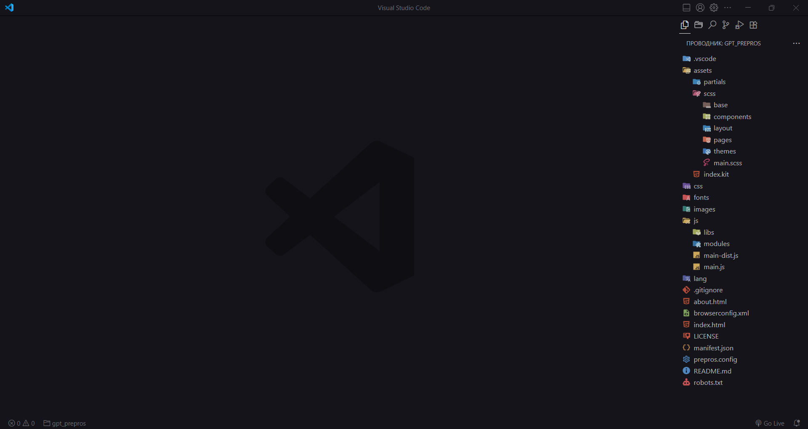

# VSCode Settings

This guide will help you customize the appearance of Visual Studio Code using the **Custom CSS and JS Loader** extension.

---

### Customization Extensions:

- [Aura Theme](https://marketplace.visualstudio.com/items?itemName=DaltonMenezes.aura-theme)
- [Material Icon Theme](https://marketplace.visualstudio.com/items?itemName=PKief.material-icon-theme)
- [Custom CSS and JS Loader](https://marketplace.visualstudio.com/items?itemName=be5invis.vscode-custom-css)
  
---

### Instructions:

1. **Install the Extensions**
   - Install all the extensions listed above from the VS Code marketplace.

2. **Modify `settings.json`**
   - Add the configuration below to your VS Code `settings.json` file. **Make sure to back up your current settings** as this may overwrite them.

3. **Add the following configuration**:

    ```jsonc
    "vscode_custom_css.imports": [
        // Absolute file paths for your custom CSS/JS files
        // For Mac or Linux:
        // "file:///Users/[your-username]/[path-of-custom-css]/vscode-custom/style.css",
        // "file:///Users/[your-username]/[path-of-custom-css]/vscode-custom/script.js"

        // For Windows:
        // "file:///C:/[path-of-custom-css]/vscode-custom/style.css",
        // "file:///C:/[path-of-custom-css]/vscode-custom/script.js"
    ]
    ```

4. **Enable "Custom CSS and JS Loader"**
   - Open the command palette (`Ctrl+Shift+P` or `Cmd+Shift+P`) and type **"Enable Custom CSS and JS"** to activate the customizations.

5. **Customize Your CSS or JS**
   - Modify the CSS or JS files to change the appearance of Visual Studio Code to your liking. Explore different areas of VS Code that you want to customize.

6. **Reload the Extension**
   - After making any changes to your CSS or JS files, reload the extension from the command palette by selecting **"Reload Custom CSS and JS"**.
  
---

### Extensions I use

- [Better Comments](https://marketplace.visualstudio.com/items?itemName=aaron-bond.better-comments)
- [Code Spell Checker](https://marketplace.visualstudio.com/items?itemName=streetsidesoftware.code-spell-checker)
- [CodeSnap](https://marketplace.visualstudio.com/items?itemName=adpyke.codesnap)
- [Color Highlight](https://marketplace.visualstudio.com/items?itemName=naumovs.color-highlight)
- [CSS Flexbox Cheatsheet](https://marketplace.visualstudio.com/items?itemName=dzhavat.css-flexbox-cheatsheet)
- [CSS Peek](https://marketplace.visualstudio.com/items?itemName=pranaygp.vscode-css-peek)
- [CSS Responsive](https://marketplace.visualstudio.com/items?itemName=mrezechi3l.css-responsive)
- [eCSStractor for VSCode](https://marketplace.visualstudio.com/items?itemName=diz.ecsstractor-port)
- [filesize](https://marketplace.visualstudio.com/items?itemName=mkxml.vscode-filesize)
- [Highlight Matching Tag](https://marketplace.visualstudio.com/items?itemName=vincaslt.highlight-matching-tag)
- [HTML to CSS autocompletion](https://marketplace.visualstudio.com/items?itemName=solnurkarim.html-to-css-autocompletion)
- [htmltagwrap](https://marketplace.visualstudio.com/items?itemName=bradgashler.htmltagwrap)
- [Image preview](https://marketplace.visualstudio.com/items?itemName=kisstkondoros.vscode-gutter-preview)
- [Import Cost](https://marketplace.visualstudio.com/items?itemName=wix.vscode-import-cost)
- [Live Sass Compiler](https://marketplace.visualstudio.com/items?itemName=glenn2223.live-sass)
- [Live Server](https://marketplace.visualstudio.com/items?itemName=ritwickdey.LiveServer)
- [MDX](https://marketplace.visualstudio.com/items?itemName=unifiedjs.vscode-mdx)
- [Path Intellisense](https://marketplace.visualstudio.com/items?itemName=christian-kohler.path-intellisense)
- [Prettier - Code formatter](https://marketplace.visualstudio.com/items?itemName=esbenp.prettier-vscode)
- [Project Manager](https://marketplace.visualstudio.com/items?itemName=alefragnani.project-manager)
- [px to rem](https://marketplace.visualstudio.com/items?itemName=sainoba.px-to-rem)
- [Sass (.sass only)](https://marketplace.visualstudio.com/items?itemName=Syler.sass-indented)
- [SCSS Formatter](https://marketplace.visualstudio.com/items?itemName=sibiraj-s.vscode-scss-formatter)
- [SCSS IntelliSense](https://marketplace.visualstudio.com/items?itemName=mrmlnc.vscode-scss)

---

### Extensions you might like

- [Auto-Open Markdown Preview](https://marketplace.visualstudio.com/items?itemName=hnw.vscode-auto-open-markdown-preview)
- [Catppuccin Perfect Icons](https://marketplace.visualstudio.com/items?itemName=thang-nm.catppuccin-perfect-icons)
- [cdnjs](https://marketplace.visualstudio.com/items?itemName=JakeWilson.vscode-cdnjs)
- [Console Ninja](https://marketplace.visualstudio.com/items?itemName=WallabyJs.console-ninja)
- [CSS-in-JS](https://marketplace.visualstudio.com/items?itemName=paulmolluzzo.convert-css-in-js)
- [Dot Log](https://marketplace.visualstudio.com/items?itemName=jaluik.dot-log)
- [Error Lens](https://marketplace.visualstudio.com/items?itemName=usernamehw.errorlens)
- [Iceberg](https://marketplace.visualstudio.com/items?itemName=harg.iceberg)
- [Icon Fonts](https://marketplace.visualstudio.com/items?itemName=idleberg.icon-fonts)
- [jsflowchart](https://marketplace.visualstudio.com/items?itemName=MULU-github.jsflowchart)
- [JSON Crack](https://marketplace.visualstudio.com/items?itemName=AykutSarac.jsoncrack-vscode)
- [Kanagawa](https://marketplace.visualstudio.com/items?itemName=qufiwefefwoyn.kanagawa)
- [Multiple cursor case preserve](https://marketplace.visualstudio.com/items?itemName=Cardinal90.multi-cursor-case-preserve)
- [Peacock](https://marketplace.visualstudio.com/items?itemName=marnix.peacock)
- [Quokka.js](https://marketplace.visualstudio.com/items?itemName=WallabyJs.quokka-vscode)
- [Snipped](https://marketplace.visualstudio.com/items?itemName=JeffersonLicet.snipped)
- [Stylelint](https://marketplace.visualstudio.com/items?itemName=stylelint.vscode-stylelint)
- [Todo Tree](https://marketplace.visualstudio.com/items?itemName=Gruntfuggly.todo-tree)
- [Version Lens](https://marketplace.visualstudio.com/items?itemName=pflannery.vscode-versionlens)
- [vscode-faker](https://marketplace.visualstudio.com/items?itemName=deerawan.vscode-faker)

---

Feel free to explore and make Visual Studio Code look exactly the way you want it!
